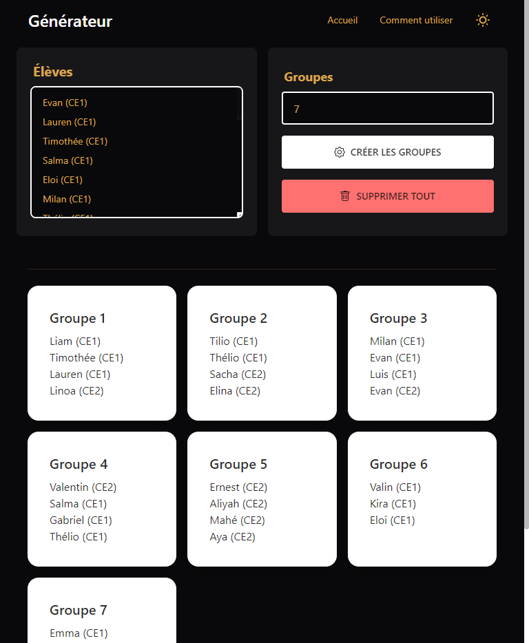

# 🎓 Generator Classes 🎓

#### _An application for generating classes randomly._

> my sister said to me :
> `i need a group generator, i will have 7 tables in the classroom, 4 with 4 students (2 ce2 and 2 ce1)
and 3 with 1 ce2 and 2 ce1
I need something that mixes the ce2s and ce1s every week
but it mixes me automatically when I have a hand on it
a sort of map with my ce2s placed first and then I add my ce1s
but I'd have to be able to enter my pupils' levels too.`  
> ce2 = 8 years old  
> ce1 = 7 years old



## How to run ??

> **(use pnpm // npm // yarn but don't push the lock file)**

#### _dev_

```
git clone
-> add .env file
pnpm install
pnpm run dev
pnpm run build
```

## Tech stack 💻

That is the list of technologies that this project use.

> **Front**
>
> > - [NextJs (ReactJS)](https://nextjs.org/)
> > - [TailwindCSS](https://tailwindcss.com/)
> > - [TailwindUI](https://tailwindui.com/)
> > - [DaisyUI](https://daisyui.com/)
> > - [Prettier](https://prettier.io/)
> > - [EsLint](https://eslint.org/)
> > - [Husky](https://typicode.github.io/husky/#/)
>
> **CI/CD**
>
> > - GitHub CI
> > - [Renovate](https://www.mend.io/renovate/)

> **Serveur**
>
> > - [CapRover](https://caprover.com/)
> > - VPS Linux (Debian)
> > - [Docker](https://www.docker.com/)
> > - [Fail2Ban](https://www.fail2ban.org/wiki/index.php/Main_Page)
> > - [LetsEncrypt](https://letsencrypt.org/)
> > - [UFW](https://doc.ubuntu-fr.org/ufw)
> > - [DNS (OVH / CloudFlare)](https://cloudflare.com/)

> **Monitoring**
>
> > - [NetData](https://www.netdata.cloud/)
> > - [BetterUptime](https://betteruptime.com/)

> **Tools**
>
> > - [OpenCommit](https://github.com/di-sukharev/opencommit) // Tool for commit messages in GitKraken
> > - [Git Kraken](https://www.gitkraken.com/)
> > - [IntelliJ](https://www.jetbrains.com/idea/)
> > - [Wakatime](https://wakatime.com/)
> > - [GitHub Copilot](https://copilot.github.com/)
> > - [ChatGPT](https://chat.openai.com/)
> > - [Syncthings](https://syncthing.net/)
> > - [TinyPNG](https://tinypng.com/)
> > - [cwebp](https://developers.google.com/speed/webp/docs/cwebp)
> > - [PowerToys](https://learn.microsoft.com/en-us/windows/powertoys/)
> > - Google suit
> > - [Insomnia](https://insomnia.rest/) // [Bruno](https://github.com/usebruno/bruno)
> > - [TMUX](https://tmuxcheatsheet.com/)
> > - [Discord](https://discord.com/)

> **Design**
>
> > - [Adobe Photoshop](https://www.adobe.com/products/photoshop.html)
> > - [Adobe Illustrator](https://www.adobe.com/products/illustrator.html)
> > - [Adobe Firefly](https://www.adobe.com/sensei/generative-ai/firefly.html)
> > - [Figma](https://www.figma.com/)
> > - [MidJourney](https://midjourney.com/)

> **Forked from [ryuuwiz/team-generator](https://github.com/ryuuwiz/team-generator)**
